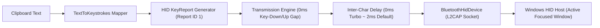

# BlueType — Clipboard to Windows PC via Bluetooth HID

<div align="center">

-3DDC84?logo=android&logoColor=white)
-brightgreen?logo=adguard&logoColor=white)


**Turn your Android smartphone into a high-speed hardware Bluetooth HID keyboard.**  
*Copy on Android, tap one button, and watch your text type itself into any Windows application instantly — zero cables, zero PC-side software, zero cloud footprint.*

</div>

---

## 📖 Executive Summary

**BlueType** bridges the gap between mobile productivity and desktop workflows. Rather than relying on cloud sync utilities, companion desktop background apps, or local network sockets that require corporate firewall exceptions, BlueType registers your Android phone directly as a **standard USB Human Interface Device (HID) Boot Keyboard** using the Android Bluetooth Classic stack.

Your Windows PC recognizes your phone as an authentic physical Bluetooth keyboard. When you press **"Paste to PC"**, BlueType reads the Android clipboard, translates each Unicode character into an 8-byte USB HID keyboard report, and streams keystrokes over the encrypted Bluetooth L2CAP link directly into whatever desktop window currently holds cursor focus.

> [!IMPORTANT]
> **Keystroke Simulation, Not Shared Clipboard:**  
> Bluetooth HID has no native protocol for "clipboard transfers" or "pasting". BlueType achieves instant transfer by simulating rapid, hardware-accurate keystrokes. Ensure your cursor is positioned in your desired Windows application (Notepad, Word, terminal, IDE, browser) before sending.

---

## ⚡ High-Throughput HID Typing Streaming Engine

BlueType features a custom high-performance Bluetooth HID transmission engine engineered for maximum character throughput without triggering OS input buffer overflows or key-repeat anomalies.



### 1. Tight-Coupled Key-Down / Key-Up Sequences
Traditional keyboard automation often inserts artificial delays while holding a key down. On Windows, holding a virtual key down for longer than the OS repeat-delay threshold (~250–500ms) causes runaway character repetition. BlueType couples key-down and key-up reports with a **0ms internal gap**:
- **Report $2N$ (Key Down):** Byte modifier + Usage code transmitted immediately.
- **Report $2N+1$ (Key Up):** Empty report (`KeyReport.EMPTY`) dispatched instantly to release the key.

### 2. Configurable Inter-Character Pacing & 0ms Turbo Mode
Inter-character delay is applied strictly **after** the key-up release report:
- **0ms (Turbo Mode):** Yields blistering throughput of **10–20 words per second** (~500–1000 characters per minute), saturated only by the host Bluetooth controller's L2CAP throughput.
- **2ms (Default):** Rock-solid stability for high-load systems or legacy Bluetooth 4.0/4.2 adapters.
- **10–40ms (Compatibility Mode):** Tunable for remote desktop sessions (RDP/Citrix/VNC) or legacy terminal emulators that drop rapid input bursts.

### 3. Buffer Saturation Protection & Throttled UI Telemetry
- **L2CAP Saturation Retries:** Monitors `BluetoothHidDevice.sendReport()` boolean dispatch acknowledgments, gracefully logging and recovering if the local Bluetooth HCI buffer experiences backpressure.
- **80ms UI Progress Throttling:** During active transmissions of thousands of characters, emitting StateFlow updates on every single keystroke causes severe Jetpack Compose recomposition thrashing on the main thread. BlueType throttles UI progress emissions to an optimal 80ms interval while guaranteeing the final 100% completion frame renders cleanly.

---

## 📱 User Interface & Experience Innovations

BlueType combines Google Material 3 design with responsive desktop hardware controls:

### 1. Glowing Shimmer Connected Device Header
The primary card at the top of the screen displays real-time connection status with the active Windows PC host:
- **Animated Shimmer Brush:** Powered by `rememberShimmerBrush()`, an infinite 2200ms linear gradient sweep pulses softly across the header when in the `Connected` state, giving an immediate, polished visual cue that the keyboard link is hot.
- **Quick Switcher:** One-tap `Devices` switcher button allows instant switching between multiple bonded Windows desktops or laptops.
- **Quick Disconnect:** Allows clean detachment of the HID session without unpairing.

### 2. Redesigned Bluetooth Device Cards
- **Intuitive Visual Hierarchy:** Displays device friendly name as primary title, monospace hardware MAC address, and persistent connection/paired status badges.
- **Horizontal Bottom Action Bar:** Eliminates awkward vertical strip wrapping by placing actions along the bottom of each card.
- **Device Info Trigger:** Direct access to hardware diagnostics for each discovered or bonded endpoint.

### 3. Device Info Drawer (`DeviceInfoSheet`)
Tapping the **"Info"** button on any device card slides up a comprehensive Material 3 modal bottom sheet detailing low-level hardware parameters:
- **Hardware MAC Address:** Displayed in clean monospace font with a **1-tap copy button** providing instant clipboard capture and haptic toast feedback.
- **Pairing Status:** Bond state verification (`Paired (Bonded)`, `Pairing in progress...`, or `Unpaired`).
- **Bluetooth Architecture:** Distinguishes between Classic (BR/EDR), Low Energy (BLE), and Dual Mode (BR/EDR + BLE) controllers.
- **Major Device Class:** Classifies host endpoints (`Computer / Desktop PC`, `Phone`, `Keyboard / Peripheral`, `Audio/Video`).
- **Signal Strength (RSSI):** Live signal strength in **dBm** for discovered hosts to diagnose wireless range issues.
- **HID Profile Support:** Verifies whether the endpoint is compatible as a standard HID Host.
- **Contextual Action Button:** Connect or disconnect directly from within the inspector drawer.

### 4. Background Quick Access Channels
- **Quick Settings Tile (`SendClipboardTileService`):** Send your clipboard directly from the Android system shade with 1 tap without bringing the main application to the foreground.
- **Persistent Notification Action:** Ongoing foreground service notification showing connected PC status with a direct **"Send Clipboard"** action button.
- **Translucent Trampoline Architecture:** Bypasses Android 10+ background clipboard access restrictions using a transient zero-UI `TrampolineActivity` that gains momentary window focus, dispatches keystrokes, and exits.

---

## 🚦 Standardized Error Codes Reference (0x01 – 0x30)

BlueType incorporates unambiguous, standardized hexadecimal error codes across all layers (Domain, Transport, Clipboard, UI, and Toasts). If a transmission fails, the exact code is displayed:

| Error Code | Error Identifier | Subsystem | Description & Root Cause | Recommended User Action |
| :---: | :--- | :--- | :--- | :--- |
| `0x01` | `ERR_BT_NOT_CONNECTED` | Transport / Core | Attempted to send keystrokes while no Bluetooth host is connected. | Select your Windows PC from the device list and tap **Connect**. |
| `0x02` | `ERR_HID_NOT_REGISTERED` | Transport / OS | The Android `BluetoothHidDevice` profile proxy is not registered with the OS daemon. | Toggle Bluetooth off and on, or restart BlueType to re-register SDP records. |
| `0x03` | `ERR_PERMISSION_DENIED` | System / Security | Missing runtime permissions (`BLUETOOTH_CONNECT` or `BLUETOOTH_SCAN` on Android 12+). | Grant Bluetooth Nearby Devices permissions in Android System Settings. |
| `0x04` | `ERR_CONNECTION_LOST` | Transport / Link | Bluetooth connection dropped abruptly mid-transmission after sending $N$ of $M$ reports. | Move phone closer to PC to reduce interference; tap **Connect** to re-establish link. |
| `0x05` | `ERR_SEND_FAILED` | Transport / HCI | `BluetoothHidDevice.sendReport()` returned false or threw an OS dispatch exception. | Ensure Windows host is awake and receptive; verify L2CAP buffer is not saturated. |
| `0x06` | `ERR_CONN_INIT_FAILED` | Transport / Link | Android failed to initiate a Bluetooth connection with the selected remote host MAC. | Ensure PC Bluetooth is turned on and discoverable; remove and re-pair if corrupted. |
| `0x10` | `ERR_UNSUPPORTED_CHIPSET` | Hardware / Driver | The phone's Bluetooth controller or kernel firmware does not support the HID Device role. | Device chipset lacks peripheral HID mode. Hardware limitation of the phone. |
| `0x11` | `ERR_BLUETOOTH_OFF` | System / Radio | Bluetooth radio adapter is disabled on the Android phone. | Turn on Bluetooth from Quick Settings or System Settings. |
| `0x20` | `ERR_CLIPBOARD_EMPTY` | Clipboard / Reader | Android clipboard has no primary clip or contains a 0-character empty string. | Copy text on your phone before tapping Send. |
| `0x21` | `ERR_CLIPBOARD_UNREADABLE` | Clipboard / Reader | Android clipboard returned null or could not be coerced to plain text. | Ensure copied item contains readable text data. |
| `0x22` | `ERR_WINDOW_NOT_FOCUSED` | Clipboard / Sandbox | Application or Trampoline does not hold input focus (Android 10+ security restriction). | Launch send via in-app button, notification action, or Quick Settings tile. |
| `0x23` | `ERR_NON_TEXT_CLIP` | Clipboard / MIME | Primary clip contains images, files, URI intents, or binary data rather than text. | BlueType only emulates keyboards; only text characters can be typed out. |
| `0x30` | `ERR_CHARS_UNSUPPORTED` | Character / Map | All characters in the text cannot be mapped to the standard US QWERTY HID usage table. | Adjust Settings to replace unsupported characters with `?` or check input glyphs. |

---

## 🖥️ Windows 10 & 11 Setup & Pairing Guide

Pairing BlueType to Windows is identical to pairing a physical wireless Bluetooth keyboard:

### Step-by-Step Pairing
1. **Enable Bluetooth on Both Devices:**
   - On Android: Ensure Bluetooth is enabled and BlueType is open.
   - On Windows: Open **Settings** $\rightarrow$ **Bluetooth & devices** $\rightarrow$ Turn Bluetooth **ON**.
2. **Make PC Discoverable:**
   - On Windows: Click **Add device** $\rightarrow$ Select **Bluetooth (Mice, keyboards, pens, audio, etc.)**.
3. **Discover and Pair:**
   - In BlueType: Under **Nearby Devices**, tap **Scan for Nearby Devices**.
   - Your Windows PC will appear in the list (identified by its computer name or desktop icon).
   - Tap **Connect** on the PC's card, or select your phone from the Windows "Add a device" popup.
4. **Confirm Pairing PIN:**
   - A 6-digit numeric pairing code will appear simultaneously on Windows and Android.
   - Tap **Pair** on Android and click **Connect / Yes** on Windows.
5. **Verify Windows Input Device Status:**
   - In Windows Settings under **Bluetooth & devices $\rightarrow$ Devices**, verify that your phone or `BlueType Keyboard` is listed under the **Input** category (not merely Audio or Other Devices).
6. **Test Typing:**
   - Open Windows **Notepad** (`notepad.exe`).
   - Copy any test paragraph on your phone.
   - Tap **Paste to PC** in BlueType. The text will immediately type into Notepad.

### Troubleshooting Windows Bluetooth HID
- **Windows shows "Paired" but keyboard won't connect:**  
  Open Windows **Device Manager** $\rightarrow$ expand **Bluetooth** $\rightarrow$ right-click your Bluetooth adapter $\rightarrow$ **Scan for hardware changes**. If needed, right-click the paired phone under Windows Settings and select **Remove device**, then re-pair from scratch.
- **Characters appear scrambled or shifted:**  
  BlueType emits standard US QWERTY scancodes. If Windows is configured with an alternative keyboard layout (such as AZERTY, QWERTZ, or Dvorak), Windows will translate the scancodes according to its own active layout. Switch your Windows language bar temporarily to `ENG - US` for exact 1:1 character fidelity.
- **Sleep mode disconnects:**  
  Windows may suspend Bluetooth controllers under aggressive power management. In Windows Device Manager, open your Bluetooth Adapter properties, navigate to **Power Management**, and uncheck *"Allow the computer to turn off this device to save power"*.

---

## 🔒 Security & Privacy Model

BlueType is engineered from the ground up for zero data exfiltration and zero trust environments:

```
+-------------------------------------------------------------------------------+
|                             BLUETYPE PRIVACY VAULT                            |
|                                                                               |
|   [ Android Clipboard ]                                                       |
|             │                                                                 |
|             ▼ (Explicit User Trigger Only)                                    |
|   [ FocusedClipboardReader ] ──▶ [ ExtraIsSensitive Check (API 33+) ]         |
|             │                                                                 |
|             ▼ (Pure JVM Conversion)                                           |
|   [ TextToKeystrokes ] ──────▶ [ 8-Byte HID Reports ]                         |
|             │                                                                 |
|             ▼ (Direct Local Link)                                             |
|   [ Bluetooth Classic L2CAP ] ─────────────────────────▶ [ Paired Windows PC ]|
|                                                                               |
|   ❌ ZERO Internet Permission in Manifest (android.permission.INTERNET omitted)  |
|   ❌ ZERO Cloud Sync / Web Sockets / HTTP APIs                                 |
|   ❌ ZERO Plaintext Logging (Timber RedactionDebugTree installed)             |
+-------------------------------------------------------------------------------+
```

### 1. Zero Network Permission Assertion
BlueType's `AndroidManifest.xml` **deliberately omits `android.permission.INTERNET`**. This is enforced at the Android OS sandbox level. The app cannot make network calls, ping telemetry servers, connect to sockets, or transmit clipboard content off the device.

### 2. Guarded Clipboard Access (No Passive Surveillance)
BlueType contains **no passive background clipboard listeners** (`OnPrimaryClipChangedListener` is intentionally not used). Clipboard data is accessed strictly at the precise millisecond the user initiates a send action from a focused window.

### 3. Sensitive Clipboard Detection (API 33+)
On Android 13 and above, BlueType inspects `ClipData.Description.EXTRA_IS_SENSITIVE`. If a password manager (1Password, Bitwarden, KeePass, Google Password Manager) flags copied credentials as sensitive, BlueType halts transmission and prompts the user with an explicit confirmation dialog before dispatching.

### 4. Timber Redaction Logging Tree
Logging is guarded by `RedactionDebugTree`. Any log statement attempting to output clipboard payload identifiers is intercepted and scrubbed to `[REDACTED CLIPBOARD CONTENT]` across all builds.

### 5. Auto-Clear Clipboard Option
Users can enable the **Auto-Clear Clipboard** setting. Once keystroke transmission completes, BlueType immediately clears Android's primary clipboard, minimizing the window of vulnerability to malicious third-party apps.

---

## 📋 Permissions Justification Table

| Permission | API Level | Justification & Architectural Necessity |
| :--- | :---: | :--- |
| `android.permission.BLUETOOTH_CONNECT` | 31+ | Mandatory runtime permission to register as an HID device and transmit keyboard reports to the host PC. |
| `android.permission.BLUETOOTH_SCAN` | 31+ | Enables scanning for nearby Bluetooth host PCs. Uses `neverForLocation` flag to guarantee GPS privacy. |
| `android.permission.BLUETOOTH_ADVERTISE` | 31+ | Broadcasts HID keyboard SDP records to nearby hosts during discovery. |
| `android.permission.ACCESS_FINE_LOCATION` | 28–30 | Required by legacy Android versions to perform Bluetooth discovery (`maxSdkVersion="30"`). |
| `android.permission.FOREGROUND_SERVICE` | 28+ | Keeps the Bluetooth HID connection alive and responsive when BlueType is minimized. |
| `android.permission.FOREGROUND_SERVICE_CONNECTED_DEVICE` | 34+ | Android 14+ requirement for foreground services maintaining active external device connections. |
| `android.permission.POST_NOTIFICATIONS` | 33+ | Renders persistent connection status and the one-tap "Send Clipboard" action button. |
| `android.permission.VIBRATE` | All | Provides immediate haptic tactile confirmation when keystroke streaming completes. |
| **`android.permission.INTERNET`** | **NONE** | **Deliberately omitted.** Clipboard data physically cannot leave the phone over the internet. |

---

## 🏗️ Architecture & Technology Stack

BlueType follows clean architecture principles with unidirectional data flow (UDF):

```
app/
├── src/main/java/com/example/bluetype/
│   ├── BlueTypeApplication.kt             # Application init & Timber RedactionDebugTree
│   ├── MainActivity.kt                    # Compose root container & permission dispatch
│   ├── clipboard/
│   │   ├── ClipboardReader.kt             # Interface for clipboard access
│   │   ├── FocusedClipboardReader.kt      # Window-focus-guarded reader (EXTRA_IS_SENSITIVE aware)
│   │   ├── ClipboardResult.kt             # Sealed hierarchy: Text, Sensitive, Empty, Unreadable
│   │   └── SendClipboardUseCase.kt        # Orchestrates conversion, dispatch, & auto-clearing
│   ├── data/settings/
│   │   ├── AppSettings.kt                 # Preferences model (delays, char replacement, notifications)
│   │   └── SettingsRepository.kt          # Jetpack DataStore Preferences implementation
│   ├── di/
│   │   ├── AppContainer.kt                # Application dependency container
│   │   └── TransportModule.kt             # Modular transport provider
│   ├── hid/
│   │   ├── HidTransport.kt                # Abstraction for Classic HID and future BLE HOGP
│   │   ├── BluetoothClassicHidTransport.kt# BluetoothHidDevice implementation & L2CAP streaming
│   │   ├── HidReportDescriptor.kt         # USB HID keyboard descriptor (Report ID 1) & SDP
│   │   ├── KeyReport.kt                   # 8-byte boot keyboard report data structure
│   │   ├── UsKeyboardMap.kt               # Unicode-to-HID usage code lookup tables
│   │   ├── TextToKeystrokes.kt            # Pure JVM converter (zero Android dependencies)
│   │   ├── ConnectionState.kt             # Sealed states: Disconnected, Connecting, Connected, Unsupported
│   │   └── BluetoothScanner.kt            # Discovery manager for nearby Bluetooth hosts
│   ├── notification/
│   │   └── HidNotificationBuilder.kt      # Persistent notification with action intents
│   ├── service/
│   │   ├── HidForegroundService.kt        # Android 14+ connectedDevice foreground service
│   │   └── SendClipboardTileService.kt    # System Quick Settings Tile service
│   ├── ui/
│   │   ├── MainScreen.kt                  # Material 3 scaffold, live progress, and FAB
│   │   ├── TrampolineActivity.kt          # Translucent focus-acquirer for background triggers
│   │   ├── components/
│   │   │   ├── ConnectedDeviceHeader.kt   # Top status card with live Shimmer animation
│   │   │   ├── BluetoothDeviceItem.kt     # Redesigned device card with horizontal action bar
│   │   │   ├── DeviceInfoSheet.kt         # Modal bottom sheet hardware & network inspector
│   │   │   └── Shimmer.kt                 # Infinite linear gradient shimmer brush
│   │   ├── settings/SettingsSheet.kt      # Settings bottom sheet (typing speed slider, switches)
│   │   ├── onboarding/OnboardingSheet.kt  # Permission primer & privacy rationale
│   │   ├── limitations/LimitationsDialog.kt# Plain-language explanation of hardware limitations
│   │   └── theme/                         # Slate modern Material 3 theme & color system
│   └── viewmodel/
│       └── MainViewModel.kt               # StateFlow coordinator, scan manager, & 80ms progress throttle
```

- **UI Framework:** 100% Jetpack Compose with Material 3 components and dynamic dark/light slate theming.
- **Asynchronous Execution:** Kotlin Coroutines (`Dispatchers.IO`, `SupervisorJob`) and reactive `StateFlow`.
- **Local Persistence:** AndroidX Jetpack DataStore Preferences.
- **Dependency Injection:** Lightweight manual `AppContainer` with modular testability.
- **Logging & Diagnostics:** Timber with custom `RedactionDebugTree`.

---

## 🧪 Testing & Verification

All core mapping, parsing, settings serialization, and transmission business logic are written in **pure JVM Kotlin** without Android framework dependencies, enabling test execution in seconds without emulators.

### Running Unit Tests
Ensure `JAVA_HOME` points to JDK 17+ or the Android Studio bundled JBR:

```powershell
# Windows PowerShell
$env:JAVA_HOME = "C:\Program Files\Android\Android Studio\jbr"
.\gradlew.bat testDebugUnitTest
```

### Test Suite Coverage
- `UsKeyboardMapTest`: Validates 100% coverage of printable ASCII characters, uppercase shift modifiers, numbers, symbols, and whitespace.
- `TextToKeystrokesTest`: Verifies report generation, line ending normalizations (`\r\n` $\rightarrow$ `\n`), character drop counting, and replacement character substitution.
- `SendClipboardUseCaseTest`: Validates state validation, failure on disconnected state (`[ERR_BT_NOT_CONNECTED: 0x01]`), empty string detection, and auto-clearing logic.
- `AppSettingsTest`: Verifies DataStore preference mappings, default values, and serialization.

---

## 📦 Building the Production APK

To assemble a release or debug build:

```powershell
# Compile Debug APK
.\gradlew.bat assembleDebug

# Compile Release APK (with R8 minification)
.\gradlew.bat assembleRelease
```

The resulting binaries are located at:
- `app/build/outputs/apk/debug/app-debug.apk`
- `app/build/outputs/apk/release/app-release.apk`

---

## 📄 License & Attributions

BlueType is distributed under the Apache License 2.0. Developed with precision for Android and Windows interoperability.
